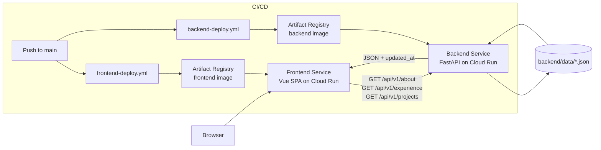

# Architecture Document

## 1. System Overview
The system is a split frontend/backend web application deployed as two independent Cloud Run services.

- Frontend service: Vue 3 SPA built by Vite and served by Nginx.
- Backend service: FastAPI API serving portfolio content.
- Data layer: versioned JSON files in-repo (`backend/data/*.json`).
- Delivery pipeline: Docker build + GitHub Actions + Artifact Registry + Cloud Run deploy.

The system is designed to serve as a recruiter-facing engineering portfolio with a clear separation between presentation, content APIs, and deployment infrastructure.

This design keeps presentation and content delivery decoupled while preserving a low-ops operational footprint.

## 2. System Components
### Frontend Application (`frontend/`)
- `src/App.vue`: primary UI composition (About, Experience, Projects, Stack sections).
- `src/composables/usePageData.js`: API integration and reactive state.
- `src/composables/*`: scroll behavior, cursor effect, mobile footer handling.
- `src/assets/css/*`: section-specific and responsive styles.
- `src/router/index.js`: route config (`/`).

### Backend API Service (`backend/`)
- `main.py`: FastAPI app bootstrap + CORS middleware + router mount.
- `routers/v1/content.py`: content endpoints; delegates application logic.
- `routers/v1/health.py`: health endpoint (`GET /health`).
- `services/content_service.py`: business response shaping for legacy and v1 contracts.
- `repositories/content_repository.py`: filesystem JSON reads + timestamp extraction.
- `core/config.py`, `core/logging.py`: backend core placeholders for settings/logging.
- `schemas/content.py`, `schemas/common.py`: schema placeholders for typed contracts.
- API model: read-only HTTP endpoints returning JSON plus `updated_at`.

### Backend Layer Responsibilities
- `router` layer: owns HTTP route declarations and request/response entry points.
- `service` layer: owns business logic and response contract shaping (`legacy` vs `v1` envelope).
- `repository` layer: owns data access (`backend/data/*.json`) and file metadata reads.
- Effective flow: `router -> service -> repository -> JSON files`.

### Data Source Layer (`backend/data/`)
- `about.json`, `exp.json`, `projects.json`.
- Files are the source of truth for displayed portfolio content.
- Backend reads files at request time and injects file mtime as `updated_at`.

### Deployment Infrastructure
- `backend/Dockerfile`: Python/Uvicorn container.
- `frontend/Dockerfile` + `frontend/nginx.conf`: multi-stage SPA build and serving.
- `.github/workflows/backend-deploy.yml`: backend build/push/deploy pipeline.
- `.github/workflows/frontend-deploy.yml`: frontend build/push/deploy pipeline.

## 3. Architecture Diagram


## 4. Data Flow
1. Browser loads SPA from frontend Cloud Run service.
2. On mount, frontend calls backend endpoints via `VITE_API_BASE`.
3. Router forwards request to service layer.
4. Service requests content from repository layer.
5. Repository reads target JSON file and timestamp from filesystem.
6. Service shapes response (`legacy` or `data` + `meta`) and returns to router.
7. API response is returned to frontend as structured JSON envelope.
8. Frontend binds response to reactive state and renders sections.
9. Frontend computes a single displayed update date from all endpoint timestamps.

### Error Handling

- Backend uses centralized exception handlers in `main.py` to standardize error responses.
- `HTTPException` is normalized into a standard error envelope, including route-not-found `404` cases.
- `FileNotFoundError` returns HTTP `404` with error code `CONTENT_NOT_FOUND`.
- Unhandled exceptions return HTTP `500` with error code `INTERNAL_ERROR`.
- Error response envelope:
```json
{
  "error": {
    "code": "CONTENT_NOT_FOUND | INTERNAL_ERROR",
    "message": "string",
    "details": null
  }
}
```
- Frontend fallback rendering still prevents UI crashes when API requests fail.

## 5. API Layer
### Endpoints
- `GET /health` (health probe)
- `GET /api/v1/about`
- `GET /api/v1/experience`
- `GET /api/v1/projects`
- `GET /api/about`
- `GET /api/experience`
- `GET /api/projects`
- `GET /` (service health/message)

### Backend Design Characteristics
- Flat REST-style endpoint surface for content domains.
- Shared JSON timestamp loader (`read_json_with_timestamp`) and service response shapers (`get_v1_content` / `get_legacy_content`) keep endpoint logic thin.
- Centralized exception handlers provide consistent API error envelopes for `404`/`500` scenarios.
- CORS enabled for cross-origin frontend calls.
- API versioning is introduced via `/api/v1/...`; legacy unversioned endpoints are retained for compatibility.
- No auth/pagination currently (appropriate for public portfolio content).

### Frontend Integration
- `usePageData.js` performs fetch calls on mount using `/api/v1/...`.
- API responses are consumed via envelope shape: `response.data` and `response.meta`.
- `meta.updated_at` values are aggregated for the sidebar/mobile footer timestamp.

## 6. Deployment Architecture
### Build and Runtime
- Frontend: Node build stage (`npm run build`) -> Nginx runtime on port `8080`.
- Backend: Python image installs requirements -> Uvicorn serves on port `8080`.

### CI/CD Flow
1. Push to `main`.
2. Path-filtered workflow selects frontend or backend pipeline.
3. Workflow authenticates to GCP and configures Docker auth.
4. Docker image is built and pushed to Artifact Registry.
5. Cloud Run service is updated with new image.

### Topology
- `vue-frontend` Cloud Run service: public web entrypoint.
- `fastapi-backend` Cloud Run service: API-only workload.
- Services scale independently.

## 7. Design Decisions
### Frontend/Backend Separation
- Pros: clearer ownership boundaries, independent release cadence, easier scaling.
- Cost: requires runtime API base URL and CORS management.

### JSON File Content Store
- Pros: simple content edits, git-native history, no DB operational overhead.
- Cost: limited query model and synchronous disk reads.

### Cloud Run Deployment
- Pros: managed runtime, container-native delivery, autoscaling by service.
- Cost: cold-start sensitivity and dependence on image-based release pipeline.

## 8. Performance Considerations

The system is optimized for a low-traffic portfolio use case.

- JSON files are small and read directly from the container filesystem, keeping latency minimal.
- Frontend loads content once on application mount to avoid repeated API calls.
- Static assets are served through Nginx for efficient file delivery.
- Cloud Run autoscaling ensures resources are provisioned only when requests arrive.

Future improvements could include API caching or CDN integration if traffic increases.

## 9. Scalability Considerations
- Add backend response caching for JSON content.
- Introduce CDN caching for static frontend assets to reduce latency globally.
- Restrict and harden CORS policy by environment.
- Extend API versioning coverage and add schema validation for long-term contract stability.
- Move content to managed DB or CMS if write workflows or query complexity increase.
- Introduce staging, smoke tests, and observability (logs/metrics/traces) in CI/CD.
- Tune Cloud Run min instances/concurrency to balance latency and cost.

## 10. Security Considerations

- Backend APIs expose only public portfolio content and require no authentication.
- CORS is configured to allow requests from the frontend domain.
- The backend does not expose file system paths or internal infrastructure details.
- Future improvements may include stricter CORS policies and request validation.
