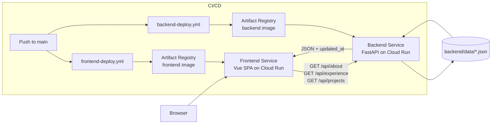

# Architecture Document（架構文件）

## 1. System Overview（系統總覽）
本系統採用前後端分離的 Web 應用架構，並以兩個獨立的 Cloud Run 服務部署。

- Frontend service：使用 Vite 建置的 Vue 3 SPA，透過 Nginx 提供服務。
- Backend service：以 FastAPI 提供作品集內容 API。
- Data layer：儲存在 repo 內、可版本化管理的 JSON 檔案（`backend/data/*.json`）。
- Delivery pipeline：Docker build + GitHub Actions + Artifact Registry + Cloud Run deploy。

此系統定位為面向 recruiter 的工程作品集，並明確區分展示層、內容 API 層與部署基礎設施。

此設計在維持低維運成本的同時，讓展示邏輯與內容交付保持解耦。

## 2. System Components（系統元件）
### Frontend Application（`frontend/`）
- `src/App.vue`：主要 UI 組成（About、Experience、Projects、Stack 區塊）。
- `src/composables/usePageData.js`：API 整合與 reactive state 管理。
- `src/composables/*`：捲動行為、游標特效、行動版 footer 處理。
- `src/assets/css/*`：各區塊樣式與 responsive 樣式。
- `src/router/index.js`：路由設定（`/`）。

### Backend API Service（`backend/`）
- `main.py`：FastAPI app 啟動、CORS middleware、router 掛載。
- `routers/main_api.py`：內容 API endpoints 與共用 JSON 載入邏輯。
- API model：唯讀 HTTP endpoints，回傳 JSON 並附帶 `updated_at`。

### Data Source Layer（`backend/data/`）
- `about.json`、`exp.json`、`projects.json`。
- 這些檔案是前台展示內容的單一真實來源（source of truth）。
- Backend 在請求時讀取檔案，並將檔案修改時間（mtime）注入為 `updated_at`。

### Deployment Infrastructure（部署基礎設施）
- `backend/Dockerfile`：Python/Uvicorn container。
- `frontend/Dockerfile` + `frontend/nginx.conf`：多階段 SPA 建置與服務。
- `.github/workflows/backend-deploy.yml`：backend build/push/deploy pipeline。
- `.github/workflows/frontend-deploy.yml`：frontend build/push/deploy pipeline。

## 3. Architecture Diagram（架構圖）

## 4. Data Flow（資料流）
1. Browser 從 frontend Cloud Run 服務載入 SPA。
2. 在 mount 階段，frontend 透過 `VITE_API_BASE` 呼叫 backend endpoints。
3. FastAPI 解析 endpoint -> 讀取目標 JSON 檔案 -> 加入 `updated_at`。
4. API response 以結構化 JSON 回傳至 frontend。
5. Frontend 將 response 綁定至 reactive state，並渲染各區塊。
6. Frontend 彙整各 endpoint 的時間戳，計算單一顯示的更新日期。

### Error Handling（錯誤處理）

- 若 backend 無法載入 JSON 檔案或 endpoint 失敗，frontend 會回退到安全渲染狀態，避免 UI 崩潰。未來可進一步加入結構化 API 錯誤回應與 frontend fallback 訊息。

## 5. API Layer（API 層）
### Endpoints
- `GET /api/about`
- `GET /api/experience`
- `GET /api/projects`
- `GET /`（service health/message）

### Backend Design Characteristics（後端設計特性）
- 採用扁平化 REST-style endpoint 面向不同內容領域。
- 使用共用檔案載入器（`load_json`）以保持 endpoint 邏輯精簡。
- 啟用 CORS 以支援跨來源 frontend 呼叫。
- 目前未導入 auth/versioning/pagination（符合公開作品集內容場景）。

### Frontend Integration（前端整合）
- `usePageData.js` 會在 mount 時執行 fetch 呼叫。
- API responses 直接在 Vue templates 中渲染。
- `updated_at` metadata 會彙整成 sidebar/mobile footer 顯示時間戳。

## 6. Deployment Architecture（部署架構）
### Build and Runtime
- Frontend：Node build stage（`npm run build`）-> Nginx runtime（port `8080`）。
- Backend：Python image 安裝 requirements -> Uvicorn 提供服務（port `8080`）。

### CI/CD Flow
1. Push 至 `main`。
2. 由 path-filtered workflow 選擇 frontend 或 backend pipeline。
3. Workflow 完成 GCP 驗證並設定 Docker auth。
4. 建置 Docker image 並推送至 Artifact Registry。
5. 以新 image 更新 Cloud Run 服務。

### Topology（拓撲）
- `vue-frontend` Cloud Run service：公開 Web 入口。
- `fastapi-backend` Cloud Run service：僅 API 工作負載。
- 兩個服務可獨立擴縮。

## 7. Design Decisions（設計決策）
### Frontend/Backend Separation（前後端分離）
- Pros：責任邊界清楚、發版節奏可獨立、擴充更容易。
- Cost：需要管理執行期 API base URL 與 CORS。

### JSON File Content Store（JSON 檔案內容儲存）
- Pros：內容修改簡單、git 原生歷史可追蹤、無 DB 維運負擔。
- Cost：查詢模型受限，且需同步磁碟讀取。

### Cloud Run Deployment
- Pros：受管 runtime、container-native 交付、可按服務 autoscaling。
- Cost：對 cold start 較敏感，並依賴 image-based release pipeline。

## 8. Performance Considerations（效能考量）

系統目前針對低流量作品集場景進行優化。

- JSON 檔案體積小，直接由 container filesystem 讀取，延遲低。
- Frontend 在 application mount 時載入一次內容，避免重複 API 呼叫。
- Static assets 由 Nginx 提供，以提升檔案傳輸效率。
- Cloud Run autoscaling 可在請求到達時動態配置資源。

若流量成長，未來可加入 API caching 或 CDN 整合。

## 9. Scalability Considerations（可擴充性考量）
- 新增 backend response caching（針對 JSON 內容）。
- 對 frontend static assets 導入 CDN caching，以降低全球延遲。
- 依環境限制並強化 CORS policy。
- 導入 API versioning 與 schema validation，提升長期契約穩定性。
- 當寫入流程或查詢複雜度提升時，將內容遷移至 managed DB 或 CMS。
- 在 CI/CD 中加入 staging、smoke tests、observability（logs/metrics/traces）。
- 調整 Cloud Run min instances/concurrency 以平衡延遲與成本。

## 10. Security Considerations（安全性考量）

- Backend APIs 僅公開作品集內容，不需要 authentication。
- CORS 已設定為允許來自 frontend domain 的請求。
- Backend 不暴露檔案系統路徑或內部基礎設施細節。
- 未來可加入更嚴格的 CORS policy 與 request validation。
