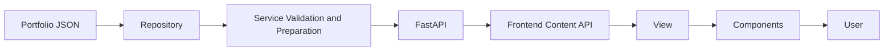
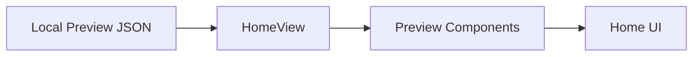
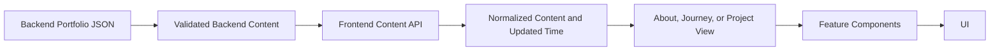
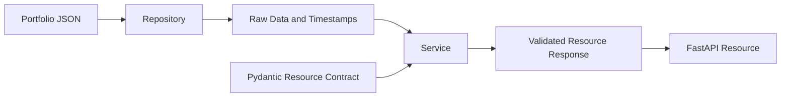
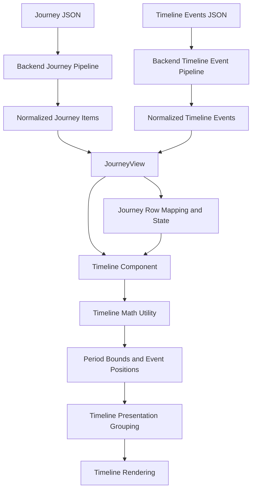
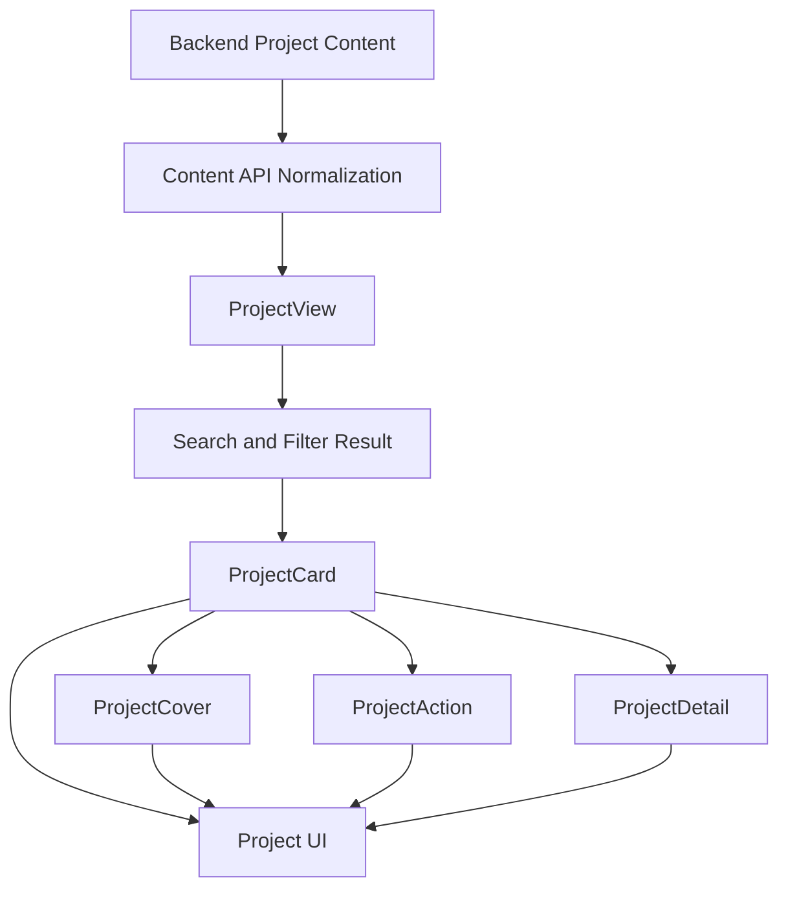
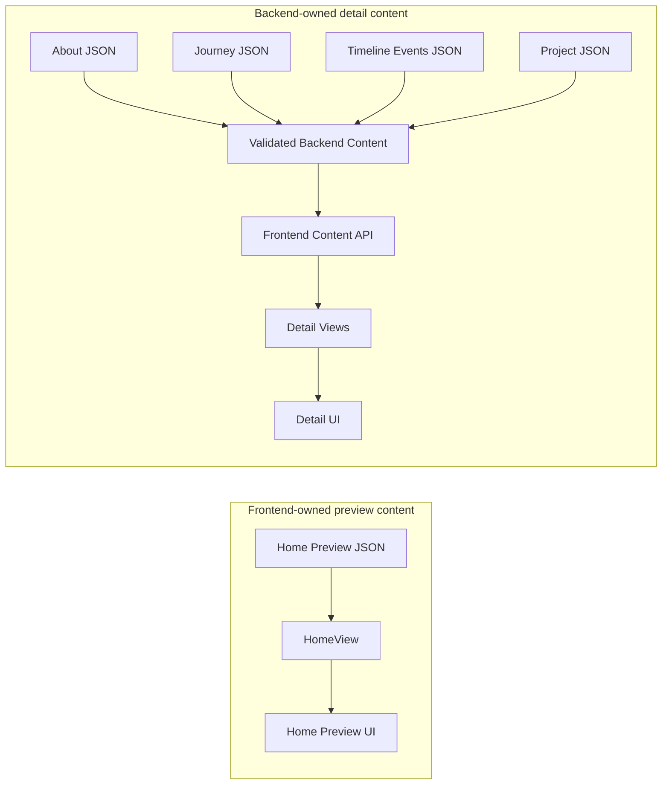

# System Data Flow

## System Overview

This document traces the project's one-way, read-only content flows from their persistent JSON sources through runtime transformations to rendered output. Backend portfolio JSON is authoritative for complete detail content, while frontend local JSON is authoritative for the intentionally smaller Home previews.

Backend content moves through repository access, service validation, transport, frontend normalization, and View-level derivation before components render it. Home preview content follows a shorter frontend-only path. The architectural responsibilities behind these boundaries are defined in `BACKEND.md` and `FRONTEND.md`.

There is no runtime content write path, database, or client-side persistence layer. Runtime transformations exist only in memory, and durable changes are made to the owning JSON source.

## High-Level Runtime Flow

Authoritative detail content begins in backend portfolio JSON and ends as user-visible output. Each intermediate stage produces the form needed by the next consumer without replacing the JSON source of truth. The backend-only transformations within this lifecycle are detailed below.

## Home Preview Flow

Home intentionally bypasses the backend for its primary About, Journey, and Projects previews. The preview data is small, bundled with the frontend, and moves through HomeView into preview components without backend normalization.

This flow contains summary content only. It does not duplicate complete About sections, Journey details, Timeline Events, or Project details. Shared public summary fields may require deliberate synchronization, while Home-specific wording and ordering remain frontend presentation concerns.

Last Updated is the exception within the Home shell: it is derived from backend content metadata and follows the backend detail-content path described below.

## Detail Page Flow

About, Journey, and Projects consume complete content from the backend-owned sources.

The backend produces validated resource content. The Content API normalizes the response for the selected View, which may derive transient page data before passing render-ready values to feature components. Those runtime forms are consumers of the backend source rather than new persistent copies.

## Backend Content Pipeline

Backend JSON is read with its filesystem metadata, then aggregated or ordered as required and validated against the resource contract. The resulting response is the backend pipeline's output and the frontend Content API's input.

Validation changes the runtime representation, not ownership: JSON remains the persistent content source, and no backend stage writes the validated response back to disk. Layer design details remain in `BACKEND.md`.

## Journey Timeline Flow

Journey content and Timeline Events are separate backend-owned resources that meet in JourneyView.

The two normalized datasets converge in JourneyView. Journey items become shared rows and presentation state; Journey items and Timeline Events then enter Timeline grouping and deterministic date-position calculation before being rendered as nodes, segments, labels, and event markers.

Timeline Events do not become Journey entries and do not create Journey Sections or Details. Journey Detail rows remain presentation content rather than additional time periods, so Timeline rendering consumes the View's row mapping instead of deriving time length from expanded content.

## Project Rendering Flow

Normalized Project data enters ProjectView, where search and filters derive the visible collection without changing the normalized source. Each visible Project then moves through ProjectCard into summary output and the composed ProjectCover, ProjectAction, and ProjectDetail renderers.

The same Project object supplies summary and detail rendering. Components do not reconstruct Project data or maintain separate detail content. Home Project previews remain on the independent local-preview flow.

## Source of Truth

The two source groups are intentionally distinct. Frontend Home JSON owns preview-scale content and ends in Home rendering. Backend portfolio JSON owns complete resource content and reaches detail rendering only after backend validation and frontend normalization. Neither runtime path persists its derived output as another authoritative source.

## Data Ownership

| Data | Source of Truth | Transformation | Consumer |
|---|---|---|---|
| About | Backend About JSON | Repository read, service validation, Content API normalization | About View and section rendering |
| Journey | Backend Journey JSON files | Aggregation, ordering, validation, frontend normalization, View row mapping | Journey Sections, Details, and Timeline |
| Timeline Events | Backend Timeline Events JSON | Validation, frontend normalization, Timeline containment and position calculation | Timeline rendering |
| Projects | Backend Project JSON files | Repository discovery and ordering, validation, frontend normalization, View search and filters | ProjectCard and composed Project renderers |
| Home Preview JSON | Frontend local JSON | HomeView selection and presentation mapping | Home preview components |
| Last Updated | Backend About content file timestamp metadata | Repository timestamp handling and Content API normalization | App shell, Home Sidebar, and Mobile Footer |

Authoritative content persists only in its owning JSON files. Last Updated persists as filesystem metadata rather than a separate frontend value. Filters, expansion state, Timeline placement, normalized responses, and rendered output are runtime-only data.

## Data Transformation Rules

### Permitted Boundaries

- Backend content may be read, aggregated, ordered, validated, and packaged without changing its owning JSON.
- Backend responses may be normalized into the stable content and metadata consumed by frontend Views.
- Views may derive transient collections, filters, rows, and interaction state from normalized data.
- Pure calculations may derive deterministic positions or matches from explicit runtime inputs.
- Rendering may format or omit optional values without changing the data supplied to it.

### Boundary Violations

- A derived runtime representation must not become a competing persistent source.
- Backend detail content must not reach frontend rendering without validation and normalization.
- Home preview data must not be treated as authoritative complete detail content.
- Rendering must not mutate or persist the normalized content it consumes.
- Domain calculations must not read or write authoritative content as a side effect.

## Design Principles

- **Single source of truth**: each data category has one persistent owner; complete detail content remains backend-owned, while Home previews remain intentionally frontend-owned summaries.
- **One-way data flow**: authoritative data moves through explicit transformation boundaries toward its final consumer without being written back by the runtime.
- **Stateless presentation**: rendering consumes prepared data without becoming an authoritative data owner.
- **Normalization before rendering**: backend response envelopes are normalized before feature Views consume them.
- **No runtime persistence**: the running application reads content and derives UI state in memory; durable updates occur only at the owning source.

## Documentation Relationships

- `overview.md` is the canonical whole-project architecture, page behavior, runtime context, and risk overview.
- `structure.md` is the canonical repository tree and file-level ownership reference.
- `BACKEND.md` explains backend system design, layer boundaries, and backend maintenance principles.
- `FRONTEND.md` explains frontend system design, component ownership, and frontend maintenance principles.
- `DATAFLOW.md` explains runtime data movement, transformation, consumption, and persistence boundaries.

These documents should reference rather than reproduce one another. Exact routes, endpoints, schemas, selectors, build details, and operational instructions remain outside this document. When documentation and runtime code disagree, verify the executable flow and update each document within its stated responsibility.
