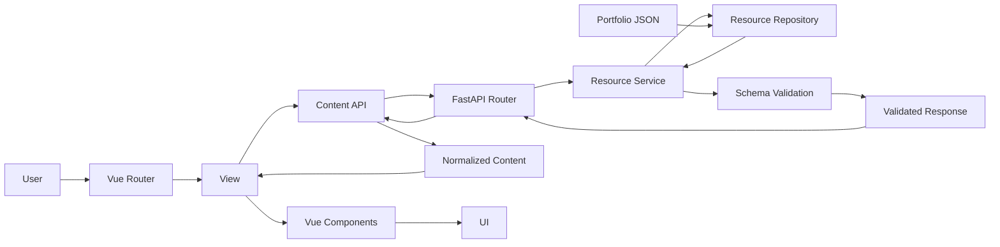
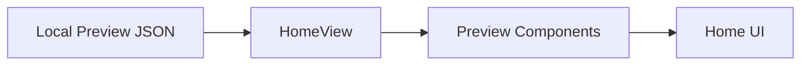
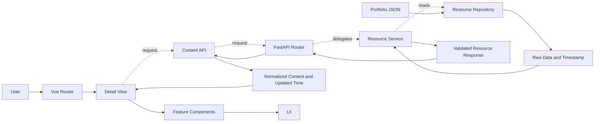
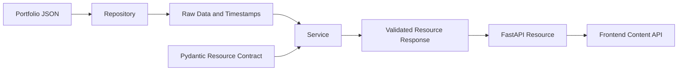
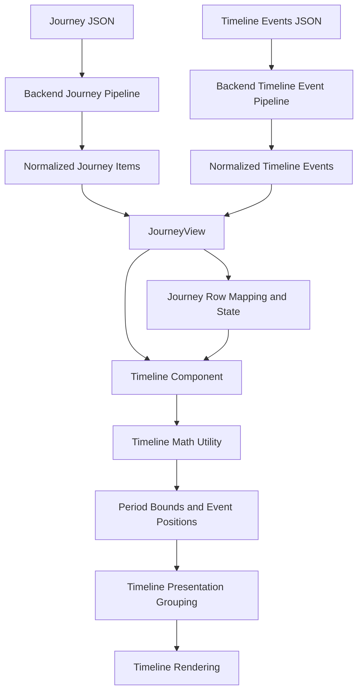
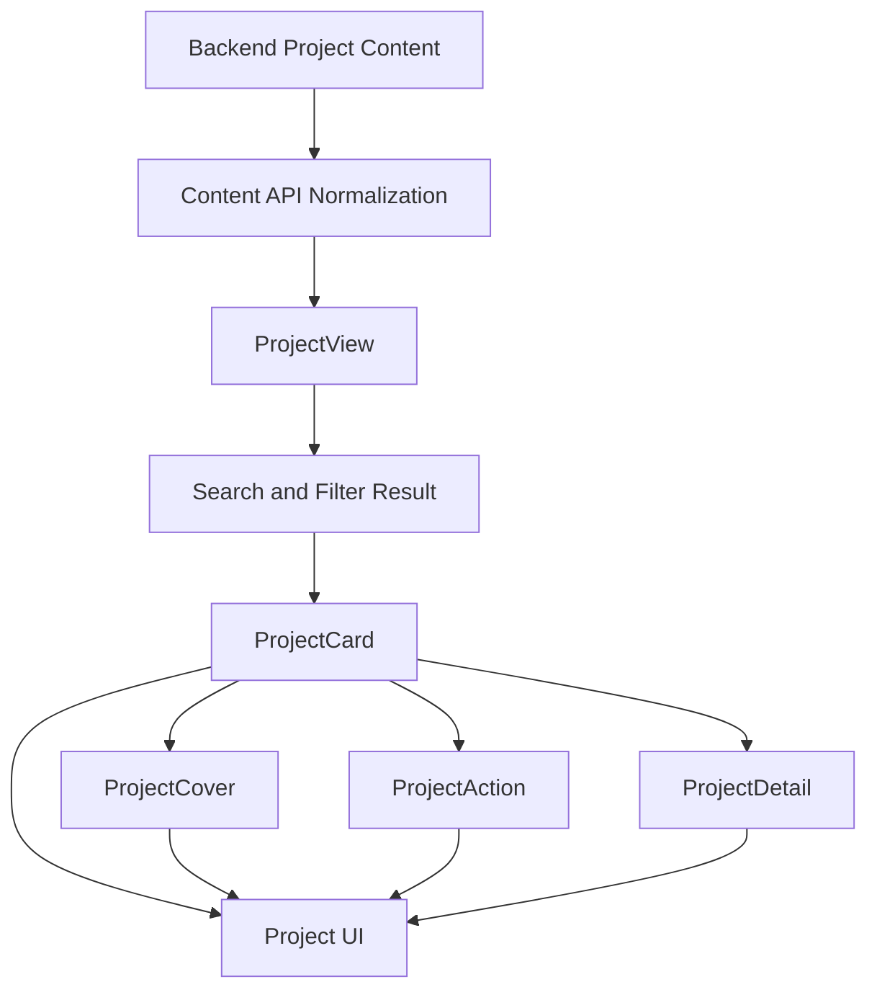

# System Data Flow

## System Overview

The project uses one-way, read-only content flows. The frontend owns presentation and route-local interaction state. The backend owns complete portfolio content and exposes validated resource responses. JSON files are the persistent source of truth: backend portfolio JSON owns detail content, while frontend local JSON owns the intentionally smaller Home previews.

Backend repositories read raw content, services coordinate validation and response preparation, and the frontend Content API normalizes backend responses before Views coordinate rendering. Components receive prepared data through props and render it; they do not persist or mutate authoritative content.

There is no runtime content write path, database, or client-side persistence layer. Runtime transformations exist only in memory, and durable changes are made to the owning JSON source.

## High-Level Runtime Flow

The request travels from the active View through the Content API to the backend resource layers. Raw JSON travels back through repository access and service-owned validation. The normalized frontend result returns to the same View, which supplies components with render-ready data.

## Home Preview Flow

Home intentionally bypasses the backend for its primary About, Journey, and Projects previews. The preview data is small, bundled with the frontend, and available without waiting for backend startup. HomeView owns selection and orchestration; preview components own rendering.

This flow contains summary content only. It does not duplicate complete About sections, Journey details, Timeline Events, or Project details. Shared public summary fields may require deliberate synchronization, while Home-specific wording and ordering remain frontend presentation concerns.

Last Updated is the exception within the Home shell: it is derived from backend content metadata and follows the backend detail-content path described below.

## Detail Page Flow

About, Journey, and Projects use the same backend-driven collection flow while preserving resource-specific View and component responsibilities.

The View owns request state, page-level transformations, and component coordination. The Content API owns transport-envelope normalization. Feature components own rendering and interaction within their prop and event contracts; they do not fetch the same resource again or retain a second authoritative copy.

## Backend Content Pipeline

The repository is the only backend layer that accesses portfolio files. The service combines repository output with the resource contract, preserves resource-specific ordering or lookup behavior, and prepares the validated response. FastAPI transports that response; the frontend then normalizes it for View consumption.

All backend portfolio content is subject to mandatory Pydantic validation. Validation changes confidence in the data, not its ownership: JSON remains the persistent content source, and no runtime layer writes validated data back to disk.

## Journey Timeline Flow

Journey content and Timeline Events are separate backend-owned resources that meet in JourneyView.

JourneyView owns the two resource requests, route-local active and expanded state, and shared row mapping between Journey Sections and the Timeline. The Timeline component owns presentation grouping, labels, nodes, segments, event markers, and interaction output. The Timeline math utility owns deterministic date-bound and position calculations without Vue, DOM, or API access.

Timeline Events do not become Journey entries and do not create Journey Sections or Details. Journey Detail rows remain presentation content rather than additional time periods, so Timeline rendering consumes the View's row mapping instead of deriving time length from expanded content.

## Project Rendering Flow

ProjectView owns backend loading, search and filter transformations, empty results, and the single expanded Project slug. Each normalized Project object is passed to ProjectCard. ProjectCard owns summary and expansion orchestration, then composes ProjectCover, ProjectAction, and ProjectDetail for their focused rendering responsibilities.

The same Project object supplies summary and detail rendering. Components do not reconstruct Project data or maintain separate detail content. Home Project previews remain on the independent local-preview flow.

## Data Ownership

| Data | Source of Truth | Transformation | Consumer |
|---|---|---|---|
| About | Backend About JSON | Repository read, service validation, Content API normalization | About View and section rendering |
| Journey | Backend Journey JSON files | Aggregation, ordering, validation, frontend normalization, View row mapping | Journey Sections, Details, and Timeline |
| Timeline Events | Backend Timeline Events JSON | Validation, frontend normalization, Timeline containment and position calculation | Timeline rendering |
| Projects | Backend Project JSON files | Ordered loading, validation, frontend normalization, View search and filters | ProjectCard and composed Project renderers |
| Home Preview JSON | Frontend local JSON | HomeView selection and presentation mapping | Home preview components |
| Last Updated | Backend About content file timestamp metadata | Repository timestamp handling and Content API normalization | App shell, Home Sidebar, and Mobile Footer |

Authoritative content persists only in its owning JSON files. Last Updated persists as filesystem metadata rather than a separate frontend value. Filters, expansion state, Timeline placement, normalized responses, and rendered output are runtime-only data.

## Data Transformation Rules

### Allowed Transformations

- **Repository access** may load resource-owned JSON, discover or map files, and expose timestamps.
- **Service orchestration** may validate, aggregate, order, perform resource lookup, and prepare the established response.
- **Content API normalization** may convert the backend response envelope into the stable shape consumed by Views.
- **View transformations** may derive route-local display collections, filters, expansion rows, and loading states without mutating the source response.
- **Utility calculations** may perform deterministic domain calculations from explicit inputs.
- **Component formatting** may select optional sections, format labels, and map normalized data to semantic UI.

### Disallowed Transformations

- Components do not mutate backend-owned content or persist edited copies.
- Components do not create parallel API requests for data already owned by their View.
- Utilities do not perform API calls, access the DOM, or retain mutable runtime state.
- Views do not duplicate reusable deterministic domain calculations inside templates.
- The frontend does not maintain complete detail JSON as a second source of truth.
- Backend routers and services do not bypass repository-owned filesystem access.
- Raw backend JSON does not bypass mandatory schema validation.

## Design Principles

- **Single source of truth**: each data category has one persistent owner; complete detail content remains backend-owned, while Home previews remain intentionally frontend-owned summaries.
- **One-way data flow**: authoritative data moves through explicit transformation boundaries toward Views and components; user interaction emits intent back to the state owner rather than mutating content.
- **Stateless presentation**: components render props and emit events without duplicating page-level state.
- **Normalization before rendering**: backend response envelopes are normalized before feature Views consume them.
- **Content and presentation separation**: JSON owns content; frontend Views and components own presentation and interaction.
- **Pure utilities**: deterministic calculations remain independent of Vue, DOM, transport, and persistence.
- **Route-local state**: filters, active items, and expansion state remain with the owning View unless a real cross-route requirement emerges.
- **No runtime persistence**: the running application reads content and derives UI state in memory; durable updates occur only at the owning source.

## Documentation Relationships

- `overview.md` is the canonical whole-project architecture, page behavior, runtime context, and risk overview.
- `structure.md` is the canonical repository tree and file-level ownership reference.
- `BACKEND.md` explains backend system design, layer boundaries, and backend maintenance principles.
- `FRONTEND.md` explains frontend system design, component ownership, and frontend maintenance principles.
- `DATAFLOW.md` explains runtime data movement, transformation, consumption, and persistence boundaries.

These documents should reference rather than reproduce one another. Exact routes, endpoints, schemas, selectors, build details, and operational instructions remain outside this document. When documentation and runtime code disagree, verify the executable flow and update each document within its stated responsibility.
