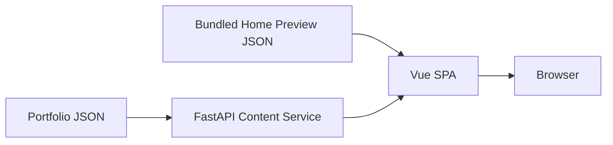

# adamtseng.com Portfolio

Adam Tseng's personal software engineering portfolio presents professional experience, engineering projects, and system-design thinking for recruiters and engineering teams. The site prioritizes clear technical communication, fast access to summary content, and structured detail pages backed by a read-only content service.

## Features

- Home landing page with bundled About, Journey, and Project previews
- Structured About detail page
- Journey sections with an interactive Timeline and expandable details
- Project search, filters, summaries, and expandable engineering details
- Responsive desktop, tablet, and mobile layouts
- Read-only backend content API with validated portfolio JSON
- Resume and professional profile links

## Technology Stack

### Frontend

- Vue 3 and Vue Router
- Vite
- Bootstrap and Bootstrap Icons
- Browser Fetch API

### Backend

- FastAPI and Uvicorn
- Pydantic validation
- JSON-backed portfolio content

### Deployment

- Docker containers for frontend and backend
- Nginx for the production Vue SPA
- Google Cloud Run deployments through GitHub Actions

## Architecture Overview



Home previews are bundled with the frontend, while complete About, Journey, Timeline Event, and Project content is owned by the backend. See [DATAFLOW.md](DATAFLOW.md) for the canonical runtime flows.

## Project Structure

```text
.
├── frontend/             # Vue SPA and bundled Home preview content
├── backend/              # FastAPI service and portfolio JSON
├── .github/workflows/    # Frontend and backend deployment workflows
└── *.md                  # Project and system design documentation
```

See [structure.md](structure.md) for the tracked repository tree and file-level ownership.

## Documentation

| Document | Purpose |
|---|---|
| [overview.md](overview.md) | Product context, whole-project architecture, current behavior, risks, and roadmap |
| [structure.md](structure.md) | Repository structure and file-level ownership |
| [BACKEND.md](BACKEND.md) | Backend system design and maintenance boundaries |
| [FRONTEND.md](FRONTEND.md) | Frontend system design and ownership philosophy |
| [DATAFLOW.md](DATAFLOW.md) | Canonical runtime data movement and source-of-truth boundaries |
| [backend/setup.md](backend/setup.md) | Backend setup, validation, and operational commands |
| [FRONTEND_REVIEW.md](docs/history/FRONTEND_REVIEW.md) | Archived frontend stabilization review |

## Getting Started

### Prerequisites

- Node.js `^20.19.0` or `>=22.12.0`, with npm
- Python 3.13, with `venv` and pip

### Run the backend

```bash
cd backend
python -m venv venv
source venv/bin/activate
python -m pip install -r requirements.txt
python scripts/validate_content_schema.py
uvicorn main:app --reload --host 127.0.0.1 --port 8080
```

### Run the frontend

In a second terminal:

```bash
cd frontend
npm ci
VITE_API_BASE=http://127.0.0.1:8080 npm run dev
```

### Development URLs

- Frontend: `http://localhost:5173`
- Backend: `http://127.0.0.1:8080`
- Backend API documentation: `http://127.0.0.1:8080/docs`

## Build & Deployment

- **Frontend:** `npm run build` produces the static SPA build, which Nginx serves from its own container.
- **Backend:** FastAPI runs independently in a Uvicorn container and reads validated portfolio JSON.
- **Production:** Separate GitHub Actions workflows build and deploy the frontend and backend services to Google Cloud Run.

Operational details remain in [overview.md](overview.md), [structure.md](structure.md), and [backend/setup.md](backend/setup.md).

## Design Philosophy

- Communicate engineering capability clearly to recruiters and engineering teams.
- Keep Home immediately readable through small bundled previews.
- Keep complete detail content backend-owned and schema-validated.
- Preserve one-way, read-only content flow.
- Keep page state with its owning View and presentation components focused.
- Share components and primitives only when real reuse exists.
- Prefer readable, responsive design and restrained motion over decorative complexity.

## Contributing

- Preserve the ownership boundaries defined in the system design documents.
- Keep content, orchestration, rendering, and domain calculations in their owning layers.
- Avoid parallel loaders, duplicated state, or competing sources of truth.
- Update the relevant canonical document when architecture or ownership changes.
- Validate affected content and applications before submitting changes.

## License

No license file is currently included. Licensing terms are to be determined.
