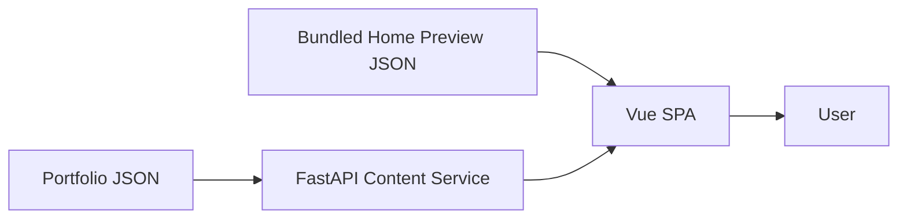

# adamtseng.com Portfolio

Adam Tseng's personal software engineering portfolio is implemented as a production-oriented full-stack application. It presents professional experience and engineering projects while demonstrating practical frontend, backend, deployment, and system-design practices.

## Features

- Recruiter-focused Home overview with About, Journey, and Project previews
- Structured About content and professional background
- Journey Timeline with expandable work and education details
- Searchable and filterable Projects with detailed engineering narratives
- Responsive experience across desktop, tablet, and mobile
- Content-driven preview and detail experiences
- Resume and professional profile links

## Technology Stack

### Frontend

- Vue 3 and Vue Router
- Vite
- Bootstrap and Bootstrap Icons
- Browser Fetch API

### Backend

- FastAPI and Uvicorn
- Pydantic validation
- JSON-backed portfolio content

### Deployment

- Docker containers for frontend and backend
- Nginx for the production Vue SPA
- Google Cloud Run deployments through GitHub Actions

## Architecture Overview



Home previews are bundled with the frontend, while complete About, Journey, Timeline Event, and Project content is owned by the backend. See [overview.md](overview.md) for the whole-project architecture and [DATAFLOW.md](DATAFLOW.md) for canonical runtime flows.

## Project Structure

```text
.
├── frontend/             # Vue SPA and bundled Home preview content
├── backend/              # FastAPI service and portfolio JSON
├── .github/workflows/    # Frontend and backend deployment workflows
├── docs/history/         # Archived reference documents
└── *.md                  # Current project and system design documents
```

See [structure.md](structure.md) for the tracked repository tree and file-level ownership.

## Documentation

### Current documents

| Document | Purpose |
|---|---|
| [overview.md](overview.md) | Product context, whole-project architecture, current behavior, risks, and roadmap |
| [structure.md](structure.md) | Repository structure and file-level ownership |
| [BACKEND.md](BACKEND.md) | Backend system design and maintenance boundaries |
| [FRONTEND.md](FRONTEND.md) | Frontend system design and ownership philosophy |
| [DATAFLOW.md](DATAFLOW.md) | Canonical runtime data movement and source-of-truth boundaries |
| [backend/setup.md](backend/setup.md) | Backend setup, validation, and operational commands |

### Historical documents

Historical documents are reference-only and do not define the current architecture.

| Document | Purpose |
|---|---|
| [FRONTEND_REVIEW.md](docs/history/FRONTEND_REVIEW.md) | Archived frontend stabilization review |

## Documentation Reading Order

1. **README.md** — repository entry point and local startup.
2. **[overview.md](overview.md)** — whole-project architecture and context.
3. **[structure.md](structure.md)** — repository structure and ownership.
4. **[BACKEND.md](BACKEND.md) / [FRONTEND.md](FRONTEND.md)** — system design details for each application.
5. **[DATAFLOW.md](DATAFLOW.md)** — runtime data movement and source-of-truth boundaries.

## Getting Started

The frontend and backend run as independent local processes. Start them in separate terminals.

### Prerequisites

- Node.js `^20.19.0` or `>=22.12.0`, with npm
- Python 3.13, with `venv` and pip

### Run the backend

```bash
cd backend
python -m venv venv
source venv/bin/activate
python -m pip install -r requirements.txt
python scripts/validate_content_schema.py
uvicorn main:app --reload --host 127.0.0.1 --port 8080
```

### Run the frontend

```bash
cd frontend
npm ci
VITE_API_BASE=http://127.0.0.1:8080 npm run dev
```

### Development URLs

- Frontend: `http://localhost:5173`
- Backend: `http://127.0.0.1:8080`
- Backend API documentation: `http://127.0.0.1:8080/docs`

## Build & Deployment

- Frontend and backend are built and deployed as separate Docker services.
- `npm run build` produces the frontend SPA, which Nginx serves in production.
- The backend runs independently with FastAPI and Uvicorn.
- Separate GitHub Actions workflows deploy both services to Google Cloud Run.

Operational details remain in [overview.md](overview.md), [structure.md](structure.md), and [backend/setup.md](backend/setup.md).

## Design Philosophy

- Maintain clear ownership boundaries across application layers.
- Preserve one-way, read-only content flow.
- Keep complete detail content backend-owned and schema-validated.
- Keep Home previews local, small, and independently renderable.
- Keep mutable frontend state with its local owner.
- Introduce shared abstractions only when demonstrated reuse exists.
- Favor maintainability, readability, and responsive behavior over unnecessary complexity.

## Contributing

- Preserve the ownership boundaries defined in the system design documents.
- Keep content, orchestration, rendering, and domain calculations in their owning layers.
- Avoid parallel loaders, duplicated state, or competing sources of truth.
- Update the relevant canonical document when architecture or ownership changes.
- Validate affected content and applications before submitting changes.

## License

This repository currently does not include a license.
