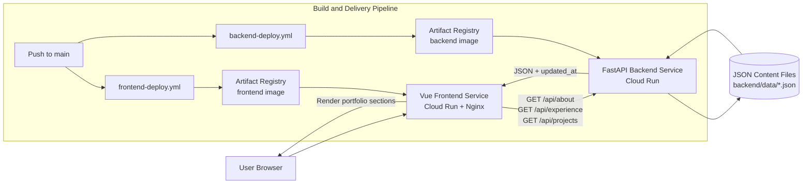

# System Design Document

## 1. System Goals
This system is designed as an engineering-focused personal portfolio that is easy to maintain and deploy while remaining technically credible for recruiters and interviewers.

Primary goals:
- Present profile, experience, and projects in a structured, recruiter-friendly format.
- Keep content updates lightweight and code-reviewable.
- Separate presentation concerns from content-serving concerns.
- Use modern cloud deployment practices with minimal operational overhead.

Problems the architecture solves:
- Avoids hardcoding content directly in frontend templates.
- Allows independent frontend/backend evolution.
- Enables predictable deployment via containerized services and CI/CD.

## 2. Requirements
### Functional Requirements
- Display personal portfolio content.
- Load project, experience, and profile data dynamically.
- Provide a clean recruiter-facing interface.

### Non-Functional Requirements
- Fast loading.
- Simple content updates.
- Maintainable architecture.
- Easy deployment.

Additional implied quality attributes:
- Readable code organization for future contributors.
- Stable public-read API behavior for frontend consumption.

## 3. High-Level Architecture
The system is split into three runtime layers and one delivery layer:
- Frontend layer: Vue 3 SPA served by Nginx.
- Backend API layer: FastAPI service with read-only content endpoints.
- Data layer: JSON files stored in repository (`backend/data/*.json`).
- Delivery layer: Docker + GitHub Actions + Artifact Registry + Cloud Run.

## 4. Component Design
### Frontend
Responsibilities:
- Vue application bootstrap and rendering (`frontend/src/main.js`, `frontend/src/App.vue`).
- UI rendering for About, Experience, Projects, and Tech Stack sections.
- API consumption through `usePageData` composable (fetch from backend endpoints).
- Routing and UI behavior:
  - Vue Router route definition (`/`).
  - Smooth section navigation.
  - Scroll handling and mobile footer behavior.
  - Visual effects (cursor glow, hover behavior).

### Backend
Responsibilities:
- FastAPI service bootstrap and middleware setup (`backend/main.py`).
- Content APIs (`/api/about`, `/api/experience`, `/api/projects`).
- JSON loading from filesystem (`backend/routers/main_api.py`).
- Timestamp injection (`updated_at`) from file modified time.

### Content Layer
Responsibilities:
- JSON-based content storage:
  - `about.json`
  - `exp.json`
  - `projects.json`
- Version-controlled content updates via git.
- Source-of-truth content model without database dependency.

### Infrastructure
Responsibilities:
- Dockerized service packaging for frontend and backend.
- CI/CD automation with path-scoped GitHub Actions workflows.
- Cloud Run deployment as independent services.
- Artifact Registry image storage for release artifacts.

## 5. Data Flow
End-to-end runtime flow:
1. User requests the frontend URL.
2. Frontend assets are served and Vue app mounts.
3. Frontend sends API requests to backend (`/api/about`, `/api/experience`, `/api/projects`).
4. Backend endpoint resolves target JSON file and reads content.
5. Backend injects `updated_at` timestamp into response payload.
6. Backend returns structured JSON responses.
7. Frontend stores responses in reactive state and renders UI sections.
8. Frontend computes and displays unified “Last updated” information.

This implements the high-level request flow:
User request -> frontend rendering -> API request -> backend processing -> JSON content -> response -> UI rendering.

## 6. Key Design Decisions
### Separate Frontend and Backend Services
Reasoning:
- Clean separation of concerns.
- Independent deployment and rollback.
- Easier evolution/testing of each layer.

### JSON Files Instead of a Database
Reasoning:
- Very low complexity for a portfolio use case.
- Fast iteration on content with git history.
- No schema migration or DB operations overhead.

### Independent Service Deployment
Reasoning:
- Frontend/UI changes and backend/content API changes can ship independently.
- Path-filtered CI/CD reduces unnecessary build/deploy cycles.

### Cloud Run for Container Hosting
Reasoning:
- Managed container platform with autoscaling.
- Good fit for Docker-based workloads.
- Minimal ops burden compared to self-managed infrastructure.

## 7. Performance Considerations

The system is optimized for a low-traffic portfolio workload.

- JSON files are small and read directly from the container filesystem.
- Frontend requests are executed once during application mount.
- Static assets are served by Nginx for efficient delivery.
- Cloud Run autoscaling ensures resources scale with incoming requests.

Future improvements may include API response caching and CDN tuning.

## 8. Trade-offs
### Pros
- Simple architecture.
- Low operational overhead.
- Easy content updates through JSON and git.
- Clear separation of UI and API responsibilities.
- Modern, reproducible deployment pipeline.

### Cons
- Limited scalability with file-based storage.
- No CMS editing interface for non-developers.
- No dedicated caching layer yet.
- Minimal API hardening (no auth/versioning).
- Potential cold-start latency under low-traffic serverless patterns.

## 9. Scalability and Future Improvements
If traffic or system complexity grows, recommended evolution path:

1. Introduce database-backed content storage.
2. Add caching layer (e.g., Redis for API responses, CDN tuning for static assets).
3. Add admin CMS for authenticated content editing workflows.
4. Add blog and search functionality (content indexing/filtering).
5. Add analytics and observability (usage metrics, error tracking, performance telemetry).
6. Strengthen API contracts (versioning + schema validation).
7. Tighten security posture (restricted CORS, optional API auth when needed).

Current design is intentionally minimal and production-practical for a portfolio, while preserving a clear upgrade path toward higher scale and richer content operations.
