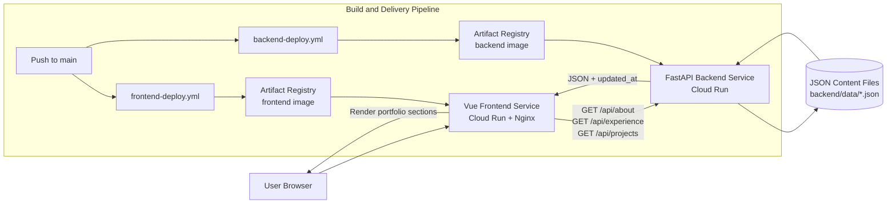

# System Design 文件

## 1. 系統目標
本系統定位為工程導向的個人作品集，目標是在易於維護與部署的前提下，對 recruiters 與 interviewers 仍具備技術可信度。

主要目標：
- 以結構化、recruiter 友善的方式呈現個人簡介、經歷與專案。
- 讓內容更新流程保持輕量，並可透過程式碼審查追蹤。
- 將展示層關注點與內容服務層關注點分離。
- 採用現代雲端部署實務，並維持低維運負擔。

此架構解決的問題：
- 避免將內容直接硬編碼於 frontend templates。
- 允許 frontend/backend 各自獨立演進。
- 透過 containerized services 與 CI/CD 提供可預期的部署流程。

## 2. 需求
### 功能性需求
- 顯示個人作品集內容。
- 動態載入專案、經歷與個人簡介資料。
- 提供乾淨且面向 recruiter 的介面。

### 非功能性需求
- 載入速度快。
- 內容更新流程簡單。
- 架構可維護。
- 易於部署。

其他隱含品質屬性：
- 具可讀性的程式碼組織，便於未來貢獻者接手。
- 提供穩定、可公開讀取的 API 行為供 frontend 使用。

## 3. 高層架構
系統分為三個執行層與一個交付層：
- Frontend layer：由 Nginx 提供服務的 Vue 3 SPA。
- Backend API layer：提供唯讀內容 endpoints 的 FastAPI 服務。
- Data layer：儲存在 repository 內的 JSON 檔案（`backend/data/*.json`）。
- Delivery layer：Docker + GitHub Actions + Artifact Registry + Cloud Run。

## 4. 元件設計
### Frontend
職責：
- Vue application 啟動與渲染（`frontend/src/main.js`, `frontend/src/App.vue`）。
- About、Experience、Projects、Tech Stack 區塊的 UI 渲染。
- 透過 `usePageData` composable 進行 API consumption（自 backend endpoints fetch）。
- Routing 與 UI 行為：
  - Vue Router 路由定義（`/`）。
  - 區塊平滑導覽。
  - 捲動處理與行動版 footer 行為。
  - 視覺效果（cursor glow、hover 行為）。

### Backend
職責：
- FastAPI 服務啟動與 middleware 設定（`backend/main.py`）。
- Content APIs（`/api/about`, `/api/experience`, `/api/projects`）。
- 自 filesystem 載入 JSON（`backend/routers/main_api.py`）。
- 由檔案修改時間注入 timestamp（`updated_at`）。

### Content Layer
職責：
- 以 JSON 為基礎的內容儲存：
  - `about.json`
  - `exp.json`
  - `projects.json`
- 透過 git 進行版本化內容更新。
- 在無資料庫依賴下維持 source-of-truth 內容模型。

### Infrastructure
職責：
- Frontend 與 backend 的 Dockerized 服務封裝。
- 以 path-scoped GitHub Actions workflows 執行 CI/CD 自動化。
- 以獨立服務形式部署至 Cloud Run。
- 透過 Artifact Registry 儲存 release artifacts 的映像檔。

## 5. 資料流
端到端執行流程：
1. User 請求 frontend URL。
2. Frontend assets 被提供，並掛載 Vue app。
3. Frontend 對 backend 發送 API 請求（`/api/about`, `/api/experience`, `/api/projects`）。
4. Backend endpoint 解析目標 JSON 檔案並讀取內容。
5. Backend 在回應 payload 注入 `updated_at` timestamp。
6. Backend 回傳結構化 JSON responses。
7. Frontend 將 responses 存入 reactive state 並渲染 UI 區塊。
8. Frontend 計算並顯示統一的「Last updated」資訊。

這對應到高層請求流程：
User request -> frontend rendering -> API request -> backend processing -> JSON content -> response -> UI rendering.

## 6. 關鍵設計決策
### 分離 Frontend 與 Backend 服務
理由：
- 關注點分離清晰。
- 可獨立部署與 rollback。
- 各層更容易獨立演進與測試。

### 使用 JSON 檔案而非資料庫
理由：
- 對作品集情境而言，複雜度非常低。
- 可透過 git 歷史快速迭代內容。
- 無 schema migration 與 DB 維運負擔。

### 獨立服務部署
理由：
- Frontend/UI 變更與 backend/content API 變更可各自發佈。
- Path-filtered CI/CD 可降低不必要的 build/deploy 週期。

### 使用 Cloud Run 作為 Container Hosting
理由：
- 受管容器平台，具 autoscaling 能力。
- 與 Docker-based 工作負載高度相容。
- 相較自管基礎設施，維運負擔更低。

## 7. 效能考量

系統已針對低流量作品集工作負載進行優化。

- JSON 檔案體積小，且直接從 container filesystem 讀取。
- Frontend 請求在 application mount 期間執行一次。
- Static assets 由 Nginx 提供，以提升傳輸效率。
- Cloud Run autoscaling 可隨進入請求調整資源。

未來可納入 API response caching 與 CDN tuning。

## 8. 取捨
### 優點
- 架構簡單。
- 維運負擔低。
- 透過 JSON 與 git 便於內容更新。
- UI 與 API 職責邊界清楚。
- 部署流程現代化且可重現。

### 缺點
- 以檔案為基礎的儲存，在擴充性上有限。
- 缺乏提供給非開發者的 CMS 編輯介面。
- 目前尚無專用 caching layer。
- API 強化程度有限（無 auth/versioning）。
- 在低流量 serverless 型態下可能有 cold-start latency。

## 9. 可擴充性與未來改進
若流量或系統複雜度成長，建議演進路徑如下：

1. 導入 database-backed content storage。
2. 增加 caching layer（例如 API responses 使用 Redis，static assets 進行 CDN tuning）。
3. 新增具驗證機制的 admin CMS 內容編輯流程。
4. 加入 blog 與 search 功能（內容索引／篩選）。
5. 加入 analytics 與 observability（使用量指標、錯誤追蹤、效能遙測）。
6. 強化 API contracts（versioning + schema validation）。
7. 強化安全姿態（限制 CORS、視需求加入可選 API auth）。

目前設計刻意維持精簡，對作品集場景具備 production-practical 特性，同時保留明確升級路徑，以支援更高規模與更豐富的內容營運需求。
